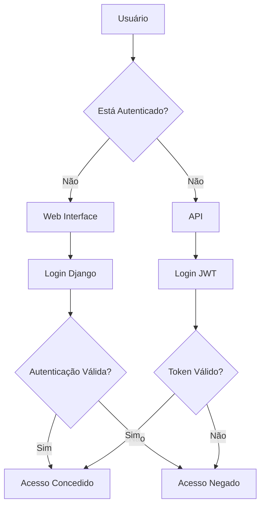
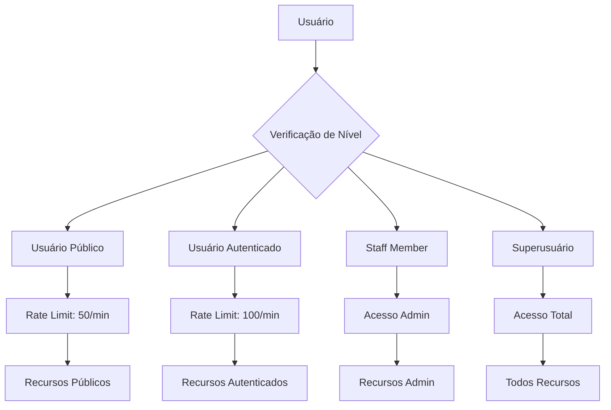
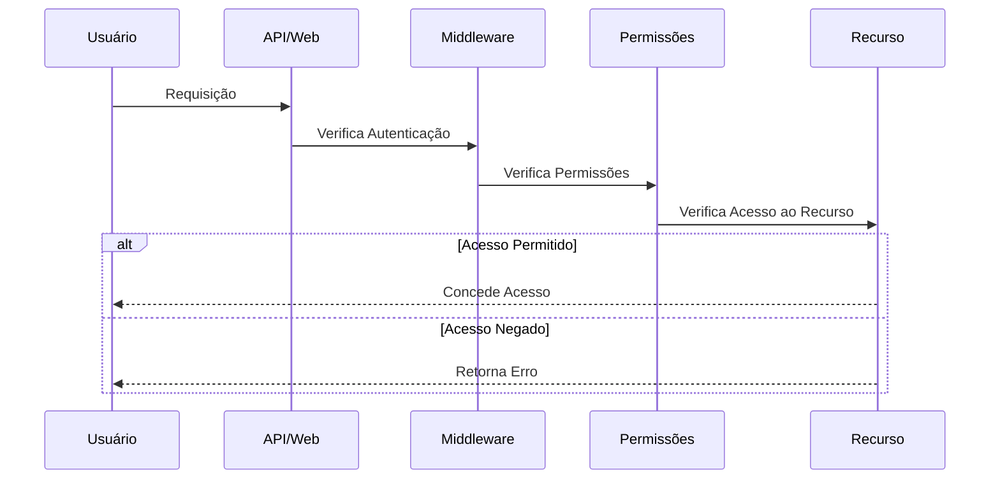
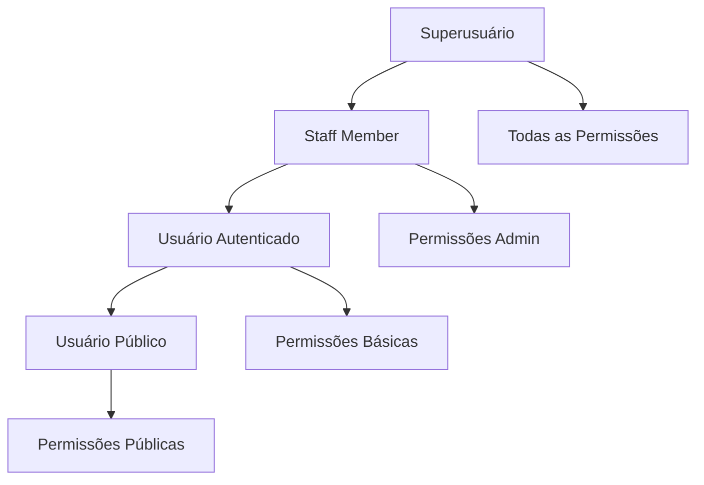
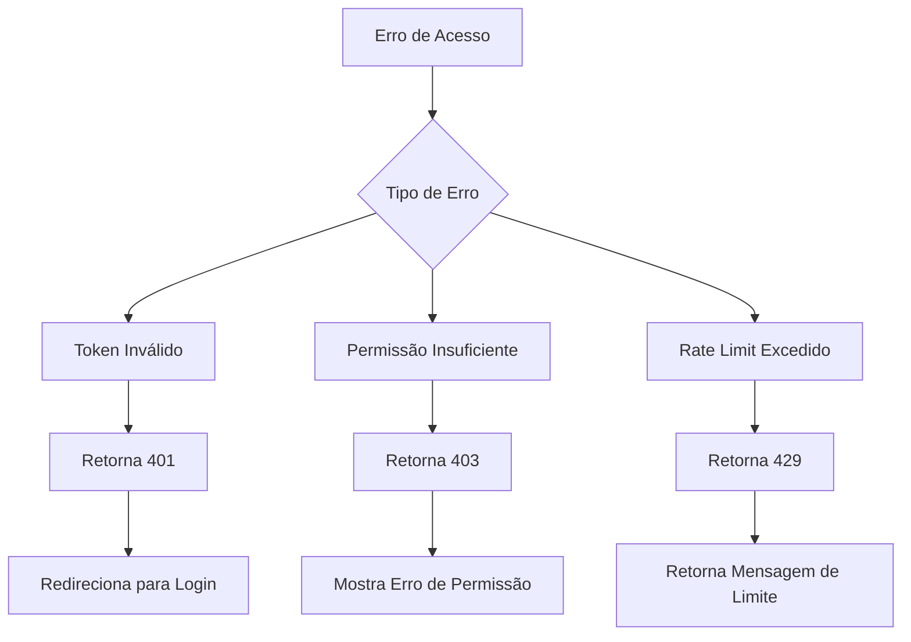

# Diagramas do Fluxo de Permissões

## 1. Fluxo de Autenticação

## 2. Níveis de Acesso

## 3. Fluxo de Verificação de Permissões

## 4. Hierarquia de Permissões

## 5. Fluxo de Tratamento de Erros

# Fluxo de Permissões de Acesso (explicação)

## 1. Autenticação

### 1.1 Autenticação Web (Django Admin)
- Utiliza o sistema de autenticação padrão do Django
- Requer login com usuário e senha
- Redireciona para página de login quando não autenticado
- Suporta autenticação de superusuários (is_superuser)

### 1.2 Autenticação API (JWT)
- Utiliza JWT (JSON Web Tokens) para autenticação
- Endpoints de autenticação:
  - `/api/auth/token/` - Geração de token JWT
  - `/api/auth/register/` - Registro de novos usuários
- Token é enviado no header como `Bearer <token>`

## 2. Níveis de Acesso

### 2.1 Usuários Públicos
- Acesso básico à API
- Podem se registrar e autenticar
- Acesso limitado aos próprios dados
- Rate limiting: 50 requisições/minuto

### 2.2 Usuários Autenticados
- Acesso completo à API
- Rate limiting: 100 requisições/minuto
- Podem acessar recursos protegidos
- Acesso aos próprios dados e recursos autorizados

### 2.3 Staff Members
- Acesso ao painel administrativo
- Podem gerenciar conteúdo e usuários
- Acesso a funcionalidades administrativas
- Verificação via `is_staff` flag

### 2.4 Superusuários
- Acesso total ao sistema
- Podem acessar todas as áreas administrativas
- Podem gerenciar todos os recursos
- Verificação via `is_superuser` flag

## 3. Permissões Específicas

### 3.1 Módulos
- **Notícias**
  - `can_view_index` - Visualizar lista de notícias
  - `can_view_detail` - Visualizar detalhes de notícias

- **FAQ**
  - `can_view_index` - Visualizar lista de FAQs

### 3.2 Aplicações Especiais
- **Auditor**
  - Requer autenticação específica
  - Acesso controlado via middleware

## 4. Middleware de Controle de Acesso

### 4.1 LoginRequiredAccess
- Controla acesso a URLs específicas
- Redireciona para login quando necessário
- Verifica autenticação do usuário
- Aplica restrições por aplicação

## 5. Proteção de Recursos

### 5.1 API Endpoints
- Autenticação via JWT
- Verificação de permissões por endpoint
- Rate limiting por tipo de usuário
- Validação de tokens

### 5.2 Web Interface
- Proteção de rotas administrativas
- Verificação de permissões por view
- Redirecionamento para login
- Mensagens de erro personalizadas

## 6. Fluxo de Verificação

1. Requisição recebida
2. Verificação de autenticação
   - Token JWT (API)
   - Sessão Django (Web)
3. Verificação de permissões
   - Nível de acesso do usuário
   - Permissões específicas
4. Acesso concedido/negado
   - Redirecionamento (Web)
   - Resposta HTTP (API)

## 7. Tratamento de Erros

### 7.1 Acesso Negado
- Redirecionamento para página de login
- Mensagens de erro personalizadas
- Logs de tentativas de acesso
- Proteção contra ataques de força bruta

### 7.2 API Errors
- Respostas HTTP apropriadas
- Mensagens de erro em JSON
- Rate limiting excedido
- Token inválido/expirado 
