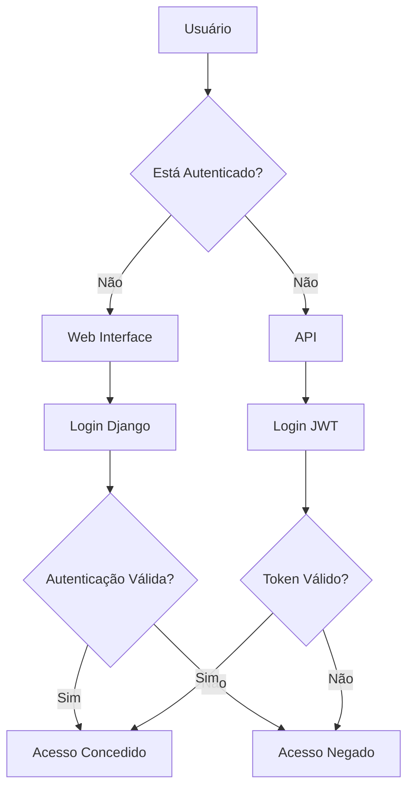
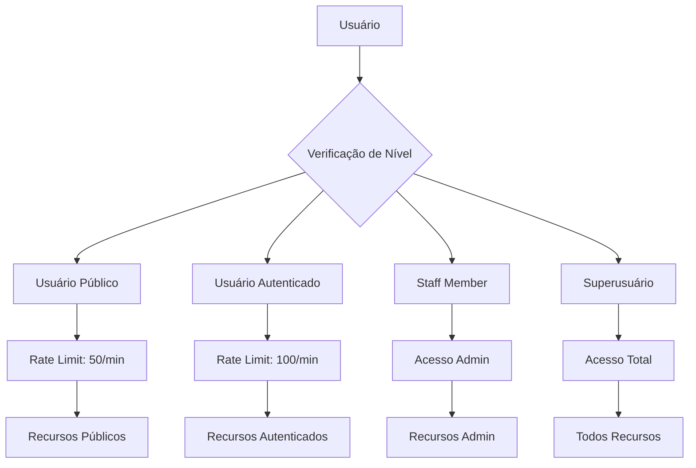
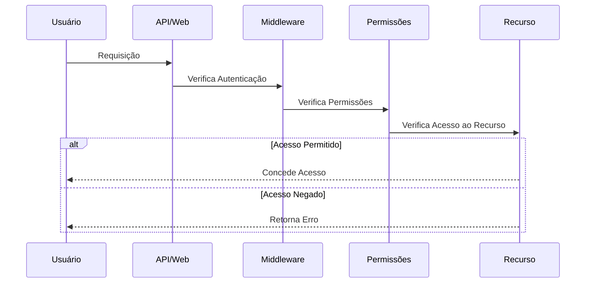
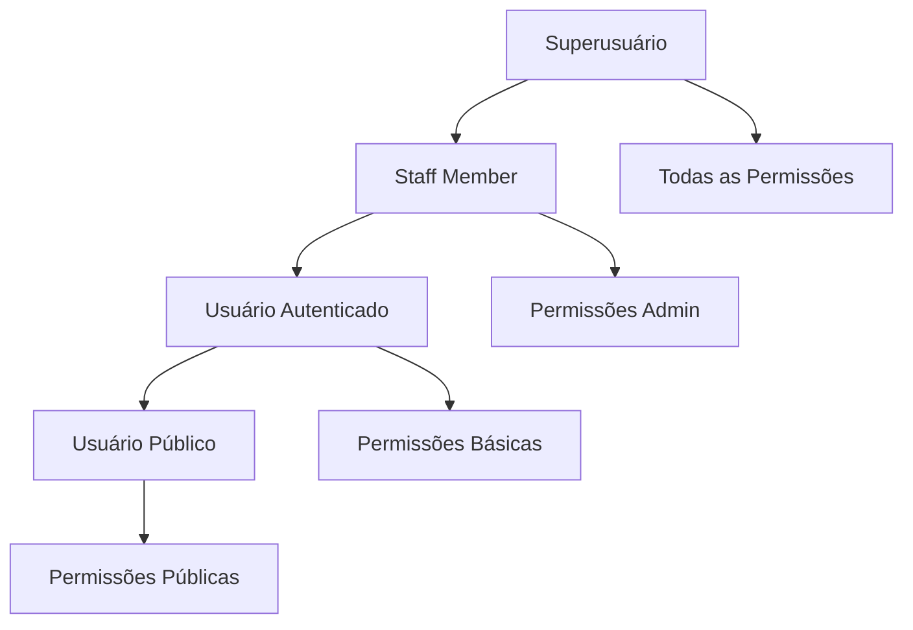
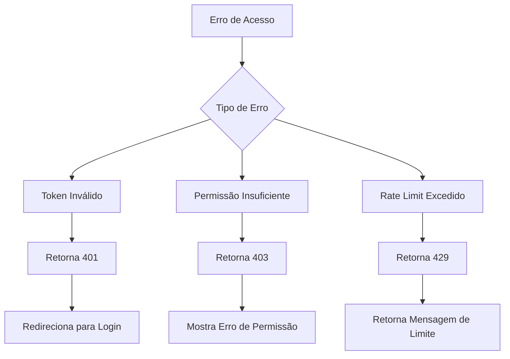

# Diagramas do Fluxo de Permissões

## 1. Fluxo de Autenticação

## 2. Níveis de Acesso

## 3. Fluxo de Verificação de Permissões

## 4. Hierarquia de Permissões

## 5. Fluxo de Tratamento de Erros

