# Diagrama de Permissões por Aplicativo

```mermaid
graph TD
    %% Aplicativos Django
    A[Aplicativos] --> B[age]
    A --> C[layout]
    A --> D[main]

    %% Permissões Padrão do Django
    E[Permissões Padrão] --> E1[add_*]
    E --> E2[change_*]
    E --> E3[delete_*]
    E --> E4[view_*]

    %% Aplicativo: age
    B --> B1[Modelos]
    B1 --> B1a[Pessoa]
    B1 --> B1b[Documento]
    B1 --> B1c[Endereço]
    
    B --> B2[Permissões Customizadas]
    B2 --> B2a[can_verify_document]
    B2 --> B2b[can_approve_address]
    B2 --> B2c[can_view_sensitive_data]

    %% Aplicativo: layout
    C --> C1[Modelos]
    C1 --> C1a[Menu]
    C1 --> C1b[Configuração]
    
    C --> C2[Permissões Customizadas]
    C2 --> C2a[can_manage_menu]
    C2 --> C2b[can_change_theme]
    C2 --> C2c[can_view_analytics]

    %% Aplicativo: main
    D --> D1[Modelos]
    D1 --> D1a[Notícia]
    D1 --> D1b[FAQ]
    
    D --> D2[Permissões Customizadas]
    D2 --> D2a[can_publish_news]
    D2 --> D2b[can_moderate_faq]
    D2 --> D2c[can_view_statistics]

    %% Estilo
    classDef app fill:#f96,stroke:#333,stroke-width:2px
    classDef model fill:#9cf,stroke:#333,stroke-width:1px
    classDef permission fill:#9f9,stroke:#333,stroke-width:1px
    classDef defaultPermission fill:#f9f,stroke:#333,stroke-width:1px

    class A,B,C,D app
    class B1a,B1b,B1c,C1a,C1b,D1a,D1b model
    class B2a,B2b,B2c,C2a,C2b,C2c,D2a,D2b,D2c permission
    class E1,E2,E3,E4 defaultPermission
```



## Explicação das Permissões

### 1. Permissões Padrão do Django
Cada modelo tem automaticamente 4 permissões básicas:
- `add_*`: Adicionar registros
- `change_*`: Modificar registros
- `delete_*`: Excluir registros
- `view_*`: Visualizar registros

### 2. Aplicativo: age
#### Modelos
- Pessoa
- Documento
- Endereço

#### Permissões Customizadas
- `can_verify_document`: Verificar documentos
- `can_approve_address`: Aprovar endereços
- `can_view_sensitive_data`: Visualizar dados sensíveis

### 3. Aplicativo: layout
#### Modelos
- Menu
- Configuração

#### Permissões Customizadas
- `can_manage_menu`: Gerenciar menus
- `can_change_theme`: Alterar temas
- `can_view_analytics`: Visualizar análises

### 4. Aplicativo: main
#### Modelos
- Notícia
- FAQ

#### Permissões Customizadas
- `can_publish_news`: Publicar notícias
- `can_moderate_faq`: Moderar FAQs
- `can_view_statistics`: Visualizar estatísticas

## Como Adicionar Permissões Customizadas

```python
# Em models.py de cada aplicativo
from django.db import models
from django.contrib.auth.models import Permission
from django.contrib.contenttypes.models import ContentType

class Meta:
    permissions = [
        ("can_verify_document", "Can verify document"),
        ("can_approve_address", "Can approve address"),
        # ... outras permissões
    ]
```

## Como Verificar Permissões

```python
# Em views.py
from django.contrib.auth.decorators import permission_required

@permission_required('age.can_verify_document')
def verify_document(request):
    # lógica da view
    pass

# Ou em templates

    <!-- conteúdo protegido -->

``` 
