# Diagrama de Permissões e Grupos

```mermaid
graph TD
    %% Grupos de Usuários
    A[Usuários] --> B[Públicos]
    A --> C[Autenticados]
    A --> D[Staff Members]
    A --> E[Superusuários]

    %% Permissões por Grupo
    B --> B1[Rate Limit: 50/min]
    B --> B2[Acesso Básico API]
    B --> B3[Dados Próprios]

    C --> C1[Rate Limit: 100/min]
    C --> C2[Acesso Completo API]
    C --> C3[Recursos Autorizados]

    D --> D1[Acesso Admin]
    D --> D2[Gerenciar Conteúdo]
    D --> D3[Gerenciar Usuários]

    E --> E1[Acesso Total]
    E --> E2[Todas Áreas Admin]
    E --> E3[Gerenciar Recursos]

    %% Permissões Específicas
    F[Permissões Específicas] --> F1[Notícias]
    F --> F2[FAQ]
    F --> F3[Auditor]

    F1 --> F1a[can_view_index]
    F1 --> F1b[can_view_detail]

    F2 --> F2a[can_view_index]

    F3 --> F3a[Autenticação Específica]
    F3 --> F3b[Middleware Controlado]

    %% Fluxo de Verificação
    G[Fluxo de Verificação] --> G1[Requisição]
    G1 --> G2[Verificação Auth]
    G2 --> G3[Verificação Permissões]
    G3 --> G4[Acesso Concedido/Negado]

    %% Estilo
    classDef group fill:#f9f,stroke:#333,stroke-width:2px
    classDef permission fill:#bbf,stroke:#333,stroke-width:1px
    classDef flow fill:#bfb,stroke:#333,stroke-width:1px

    class A,B,C,D,E group
    class B1,B2,B3,C1,C2,C3,D1,D2,D3,E1,E2,E3,F1a,F1b,F2a,F3a,F3b permission
    class G,G1,G2,G3,G4 flow
```



## Como Atribuir Permissões

### 1. Via Django Admin
1. Acesse o painel administrativo
2. Navegue até "Grupos" ou "Usuários"
3. Selecione o grupo/usuário
4. Marque as permissões desejadas
5. Salve as alterações

### 2. Via Código
```python
# Adicionar usuário a um grupo
from django.contrib.auth.models import Group, Permission
from django.contrib.auth import get_user_model

User = get_user_model()
user = User.objects.get(username='usuario')
group = Group.objects.get(name='Staff')
user.groups.add(group)

# Adicionar permissão específica
permission = Permission.objects.get(codename='can_view_index')
user.user_permissions.add(permission)
```

### 3. Via API
```python
# Exemplo de verificação de permissão em uma view
from rest_framework.permissions import BasePermission

class CanViewIndex(BasePermission):
    def has_permission(self, request, view):
        return request.user.has_perm('app.can_view_index')
```

## Notas Importantes
- Superusuários têm todas as permissões automaticamente
- Permissões podem ser atribuídas individualmente ou via grupos
- O middleware verifica as permissões em cada requisição
- Rate limiting é aplicado automaticamente por tipo de usuário 
